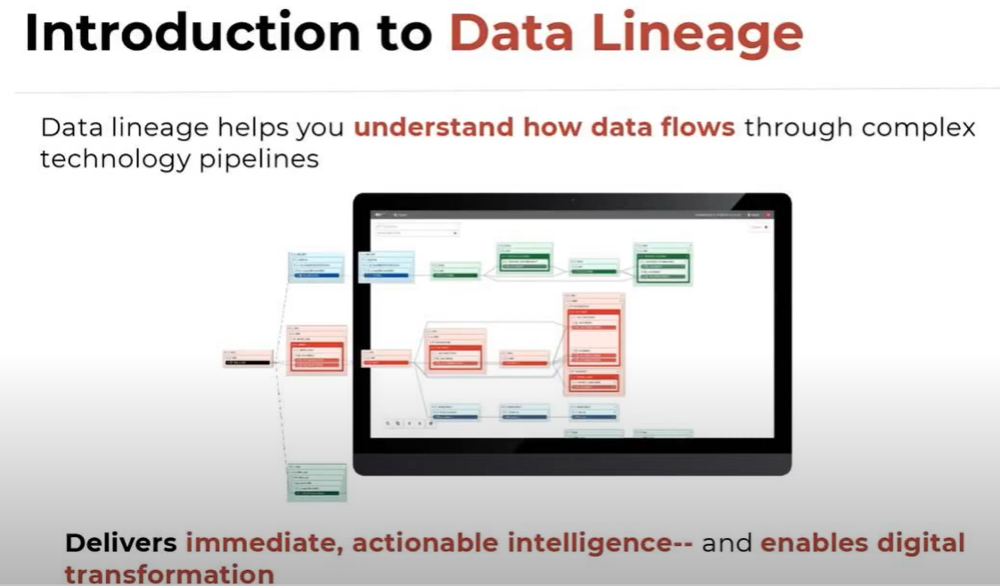
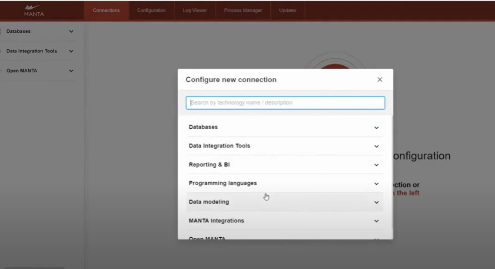
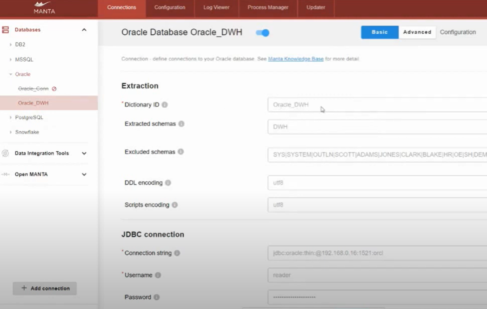
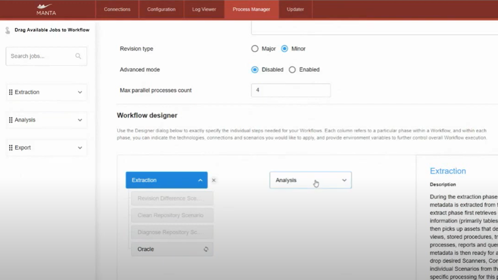
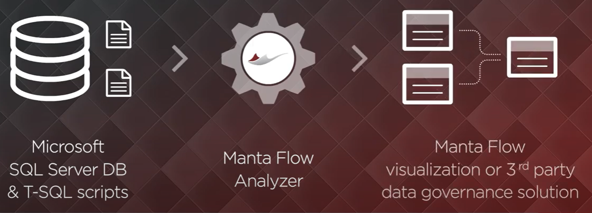

# MyManta

My Manta

MANTA is a data lineage visualization solution which extracts and analyzes metadata from report definitions, custom SQL code, and ETL workflows, to create data flows which span multiple systems and a range of technologies.

## Manta + SAP HANA

MANTA connects to the SAP HANA on-premises database or SAP HANA Cloud database, scans the metadata, and reads all the SQL programming code stored in it.

Using this information, MANTA creates a detailed visualization of the data lineage that can be pushed into any third-party metadata management solution or viewed in MANTA’s native visualization.
