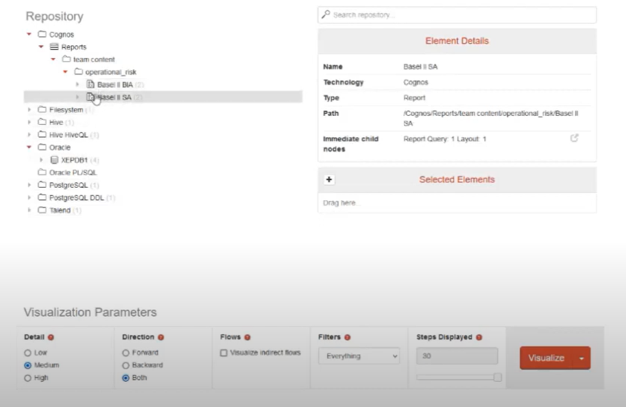
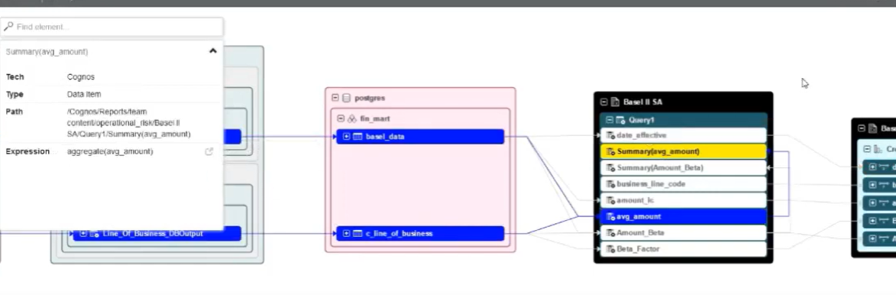
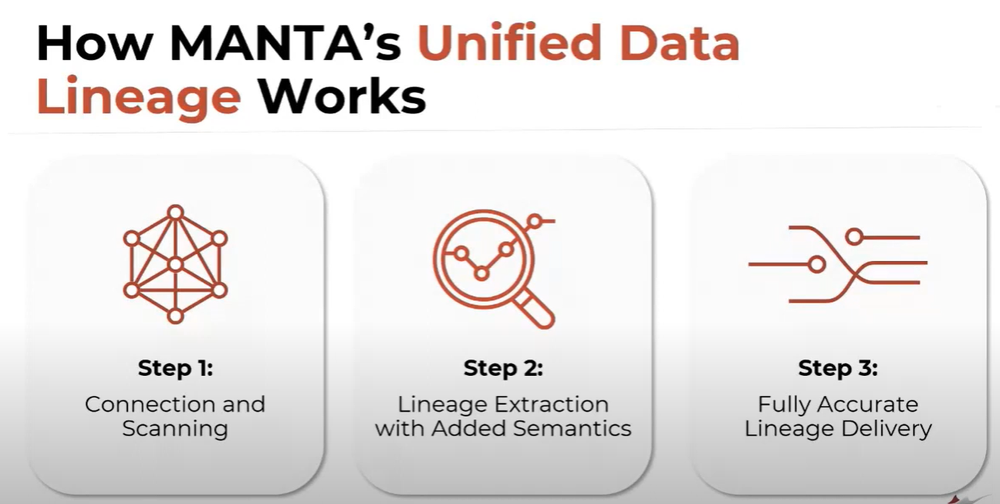
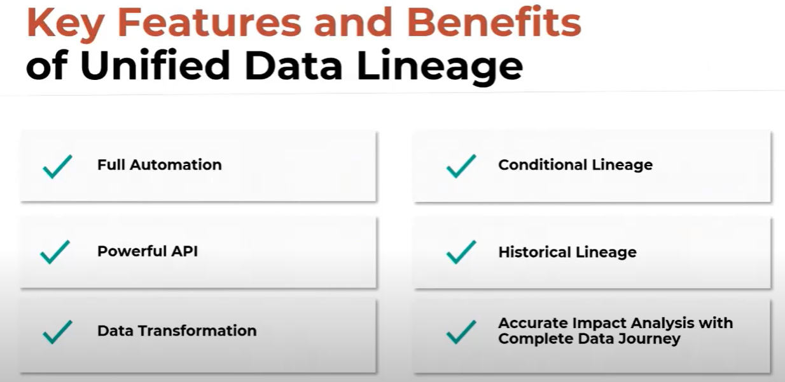

# MyManta

My Manta

MANTA is a data lineage visualization solution which extracts and analyzes metadata from report definitions, custom SQL code, and ETL workflows, to create data flows which span multiple systems and a range of technologies.

