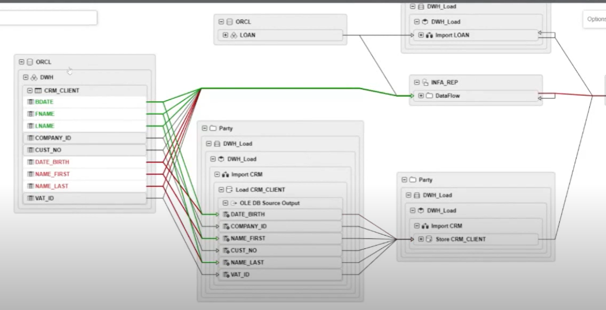

# MyManta

My Manta

## What is Manta?

MANTA is a data lineage visualization solution which extracts and analyzes metadata from report definitions, custom SQL code, and ETL workflows, to create data flows which span multiple systems and a range of technologies.

MANTA is a data lineage platform that automatically scans your data environment to build a powerful map of all data flows and deliver it through a native UI and other channels to both technical and non-technical users. It automatically scans every nook and cranny to get immediate, accurate, and up-to-date lineage.

## Demo

## Manta + SAP HANA

MANTA connects to the SAP HANA on-premises database or SAP HANA Cloud database, scans the metadata, and reads all the SQL programming code stored in it.

Using this information, MANTA creates a detailed visualization of the data lineage that can be pushed into any third-party metadata management solution or viewed in MANTA’s native visualization.
